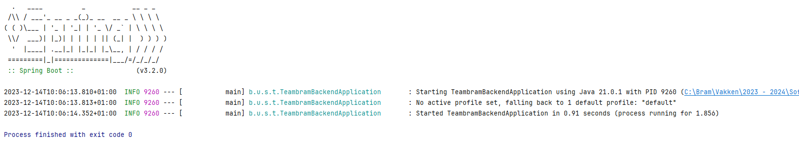

# Create a new Spring Boot project

## 1. Acceptance Criteria

At the end of this task your repository should contain a minimal, functional Spring Boot project.

## 2. Implementation Details

1. Navigate to [Spring Initializr](https://start.spring.io/)
1. Fill in the settings:
    * Project  -> `Maven`
    * Language -> `Java`
    * Spring Boot -> Last stable patch version for minor version `3.2` (so `3.2.x`, where x will vary depending on the moment you accept the assignment)
    * Group -> `be.ucll.se`
    * Artifact -> `<team-name>-backend`
    * Name -> same as artifact
    * Description -> same as artifact
    * Package name -> leave as is, do not change
    * Packaging -> jar
    * Java -> 17
1. Do not add any dependencies
1. Click `Generate`
1. Copy the contents of the downloaded zip-file to your repository
1. Load the project in your IDE
    * Make sure it runs with the installed JDK 17
    * Run the main-method, the output should be as in the screenshot below

        
1. Commit to your repository