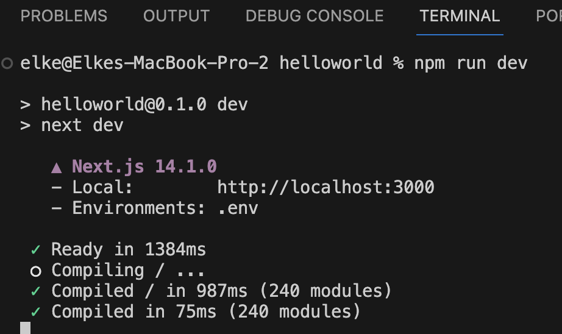

# Create a new Next.js project

## 1. Acceptance Criteria

At the end of this task your repository should contain a minimal, functional Next.js project.

## 2. Implementation Details

1. Navigate in a terminal to the empty repository map of your frontend on your computer
1. Execute the following command and select only YES for using TypeScript and NO on all other options asked:
    ```console
    npx create-next-app@latest ./ --typescipt
    ```
1. We also want to use Tailwind, therefore execute the following commands in this same repository map
    ```console
    npm install -D tailwindcss postcss autoprefixer
    npx tailwindcss init -p
    ```
1. Load the project in your IDE
    * Open a terminal and run the following command
        ```console
        npm install
        ``` 
    * Run in that same terminal the following command
        ```console
        npm run dev
        ```
        The output should be as in the screenshot below

        <a href="./images/expected-output-terminal.png">
            
        </a>
1. Commit to your repository