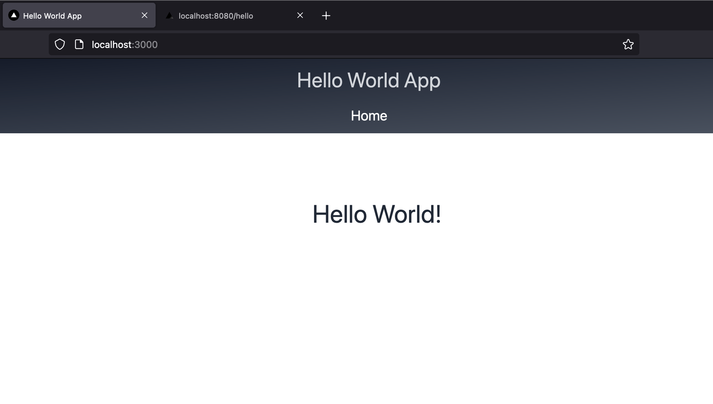

# Build minimal functionality

It is useful to let the application do _something_ before building deployment pipelines.

In this task we will make a page that displays the greeting from our backend API.

## 1. Acceptance Criteria

Make a page that displays the greeting from the backend API.

When calling `http://localhost:3000/hello` in a browser, the browser should show the screenshot below
    

The returned Greeting should be retrieved from the api-call http://localhost:8080/hello 

## 2. Implementation Details

Below is a condensed flow to follow if you need a small refresher:

1. Add a service class in a new folder services with a function using fetch to call the backend /hello api.
1. Refactor the index.tsx in the pages folder with TypeScript code to render the "Hello World!" greeting. 
    * Use the service class from the above step.
    * Use the hooks useState and useEffect to render the greeting or to render an error message (when for instance the server is down).
1. Overwrite the CSS in global.css with some TailWind CSS and use it in your index page.
1. Add a components folder and a Header.tsx component in it where you localize all code for rendering the headers of your application.