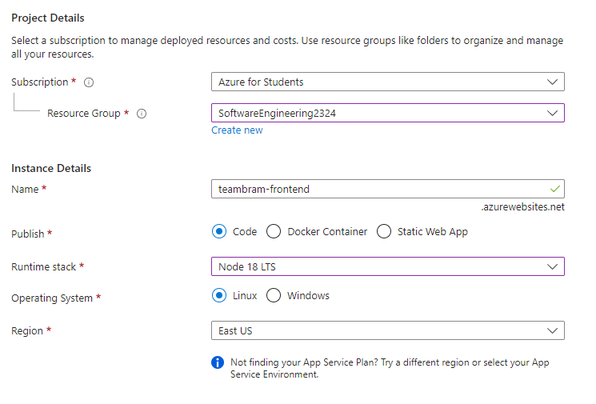
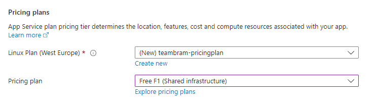
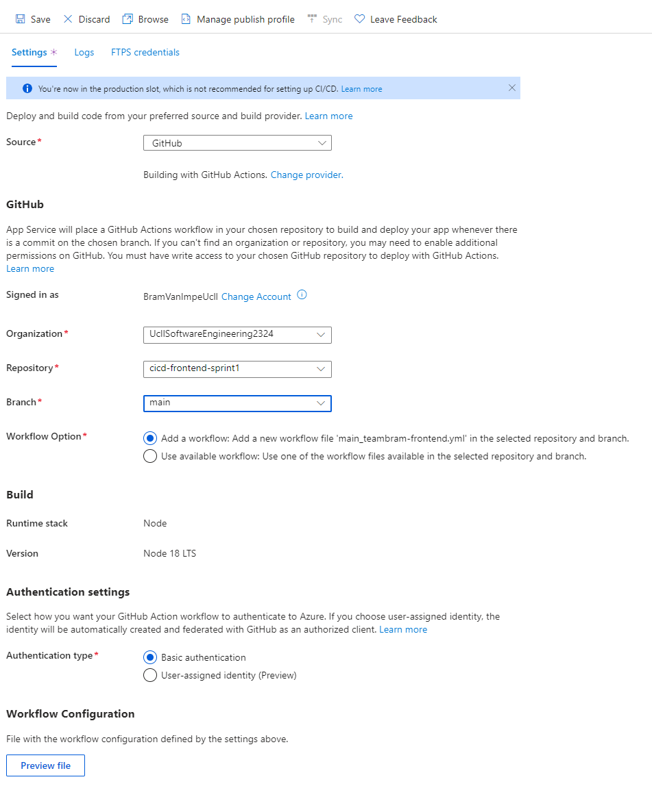

# Setup azure resource

## 1. Acceptance Criteria

At the end of this task you should have a resource in Azure to deploy your frontend application to.

Your GitHub repository should contain the building blocks to start building your own pipelines.

## 2. Implementation Details

### 2.1. Creating the resource

1. From the Azure portal, create a new "Web App" resource
1. Fill in the following information in the tab "Project Details":
    * Subscription -> Azure for Students
    * Resource Group -> The group you created in [1-set-up-azure-for-students](../../1-azure/1-set-up-azure-for-students.md)
    * Name -> `<team-name>-frontend`
    * Publish -> Code
    * Runtime stack -> Node 20 LTS
    * Operating System -> Linux
    * Region -> West Europe

    

1. Fill in the following information in the tab "Pricing Plans":
    * Linux Plan -> `<team-name>-pricingplan`
        * This plan should already exist
    * Pricing plan -> Free F1 (Shared infrastructure)
        * This should be preselected since this is taken from the already existing plan
    * Take note of [these constraints](../../../../../reference/azure/app-service-plan.md) regarding App Service Plans and compute resources
        * This will become more relevant as your project grows in scope

    

1. Click on `Review + create`
1. Double check the overview, especially the pricing plan!
1. Click on `Create`

### 2.2. Connecting your GitHub repository

1. Open your newly created App Service
1. In the menu, select Deployment Center
1. Fill in the following information:
    * Source -> GitHub
    * Signed in as -> Log in
    * Organization -> UcllSoftwareEngineering2324
    * Repository -> your frontend repository
    * Branch -> the default branch in your repository
    * Workflow Option -> Add a workflow...
      * If this option is not visible, ignore the instruction above
    * Authentication type -> Basic authentication
    * Leave the other settings as is
    
    

1. If everything is looking ok, click "Save" at the top
1. Go to your repository on GitHub and check the following things:
    * In Settings > Secrets and variables > Actions a `AZUREAPPSERVICE_PUBLISH_PROFILE..` has been added
        * This will allow your build to authenticate itself to Azure
    * In Code a folder .github/workflows has been created
        * The folder contains one workflow file

### 2.3. Preparing for the next sprint

Carefully examine the generated workflow file, you should completely understand its contents and what it is doing before continuing!

The generated pipeline has some good parts, but it does not produce a working application. We will adapt it in the following stories.

Another disadvantage is that it builds the source code and deploys it in the same workflow. It is useful to separate the two workflows:

* One pipeline builds the deployable artifact and pushes it to a _package registry_, here the artifact is stored and can be viewed and downloaded forever
* A second pipeline retrieves the artifact from the registry and deploys it to Azure

By separating the two steps we can create more complex flows:

* Build the source code, store it in the registry and on a test environment
* Once the application is verified on the test environment, deploy it to the production environment

In a later sprint, we will add a test environment. To be ready for that step, we will already create two pipelines and work with a registry in sprint-1.

Move or comment the created workflow file so that GitHub no longer runs the action. We will use parts of it in sprint-1.