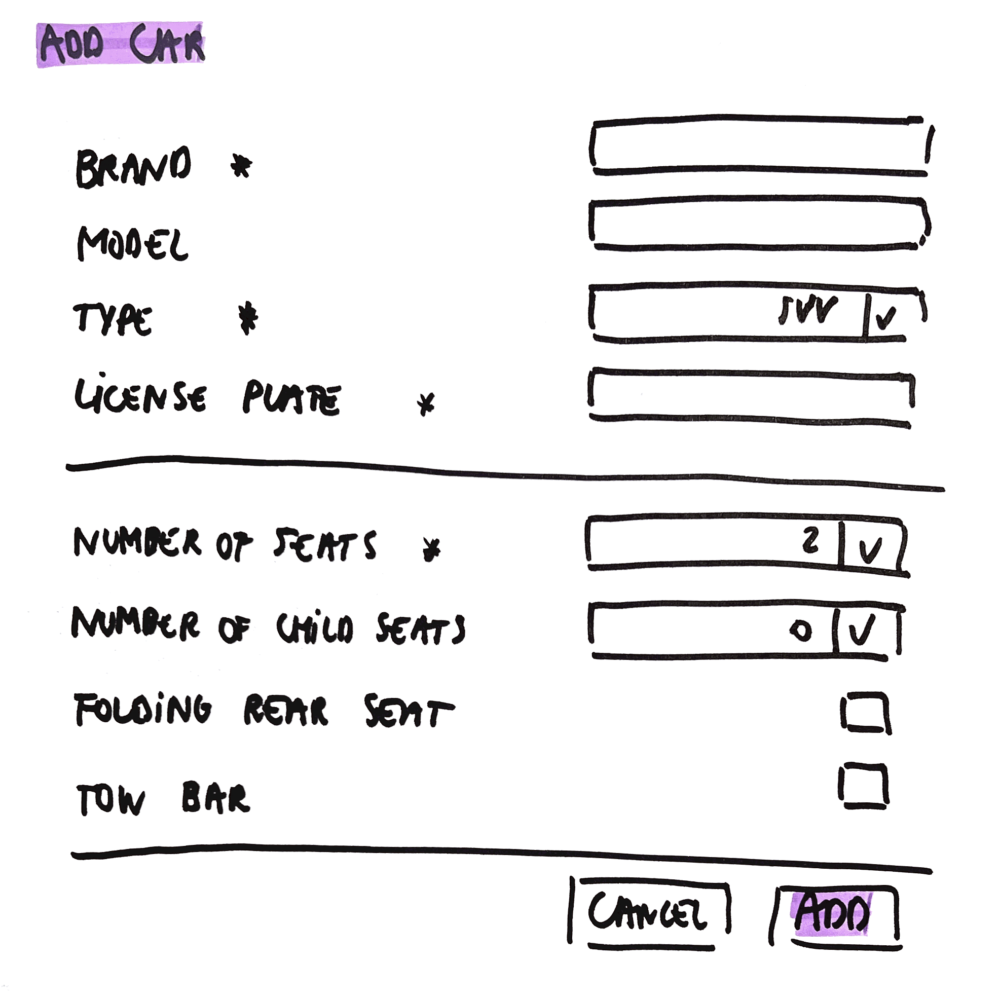

# Add Car

As a user\
I want to add one of my cars\
So that I can rent it in the future

## Mock-up

## Acceptance Criteria
* **Given** a valid brand, type, license plate and number of seats\
**When** the user adds the car\
**Then** the car is added with all the given values\
**And** the overview of all cars is given with this car added

* **Given** brand value left empty\
**When** the user adds the car\
**Then** an error message "Brand is required" is given

* **Given** type value left empty\
**When** the user adds the car\
**Then** an error message "Type is required" is given

* **Given** license plate value left empty\
**When** the user adds the car\
**Then** an error message "License plate is required" is given

* **Given** number of seats value left empty\
**When** the user adds the car\
**Then** an error message "Number of seats is required" is given