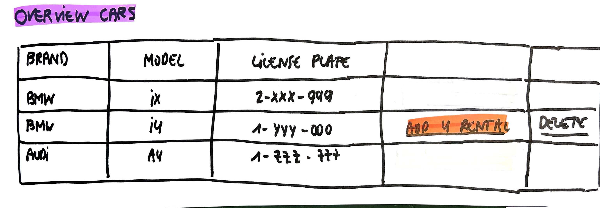

# Overview Cars

As a user\
I want to see an overview of all cars\
So that I can add rentals for a car

## Mock-up

## Acceptance Criteria
* **Given** a number of cars available\
**When** the user wants to see the overview of all cars\
**Then** for each car the brand, the model and the license plate are given
**And** the option to add a rental for this car is given, if it doesn't has any rentals yet
**And** the option to delete the car is given, only when there are no rentals for it

* **Given** no cars available\
**When** the user wants to see the overview of all cars\
**Then** a message "No cars yet" is given