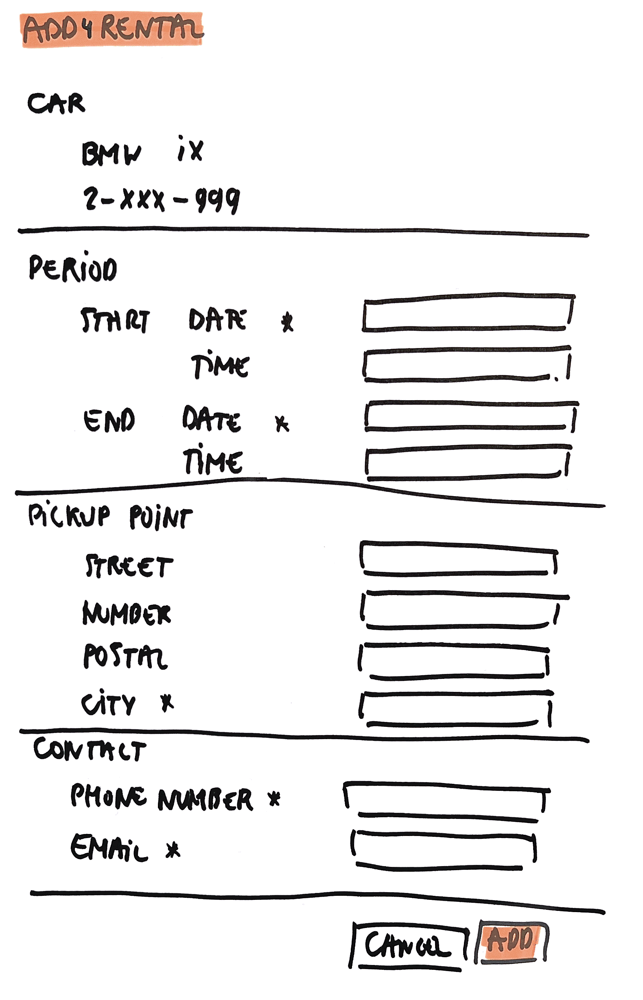

# Add 4 Rental

As a user\
I want to add a rental for one of my cars\
So that I can rent out it when I don't need it

## Mock-up

## Acceptance Criteria
* **Given** a valid start date, end date, city, phone number and email address\
**When** the user adds the car for rental\
**Then** this car rental is added with all the given values\
**And** the overview of all rentals is given with this rental added

* **Given** start date left empty\
**When** the user adds the car for rental\
**Then** an error message "Start date is required" is given

* **Given** an invalid start date\
**When** the user adds the car for rental\
**Then** an error message "Start date is invalid, it has to be of the following format dd/mm/yyyy" is given

* **Given** start date not in the future\
**When** the user adds the car for rental\
**Then** an error message "Start date is invalid, it has to be in the future" is given

* **Given** start date after end date\
**When** the user adds the car for rental\
**Then** an error message "Start date must be before the end date" is given

* **Given** end date left empty\
**When** the user adds the car for rental\
**Then** an error message "End date is required" is given

* **Given** an invalid end date\
**When** the user adds the car for rental\
**Then** an error message "End date is invalid, it has to be of the following format dd/mm/yyyy" is given

* **Given** end date not in the future\
**When** the user adds the car for rental\
**Then** an error message "End date is invalid, it has to be in the future" is given

* **Given** end date before start date\
**When** the user adds the car for rental\
**Then** an error message "End date must be after the start date" is given

* **Given** city left empty\
**When** the user adds the car for rental\
**Then** an error message "City is required" is given

* **Given** phone number value left empty\
**When** the user adds the car for rental\
**Then** an error message "Phone number is required" is given

* **Given** email value left empty\
**When** the user adds the car for rental\
**Then** an error message "Email is required" is given

* **Given** no valid email address\
**When** the user adds the car for rental\
**Then** an error message "Email value is invalid, it has to be of the following format xxx@yyy.zzz" is given
