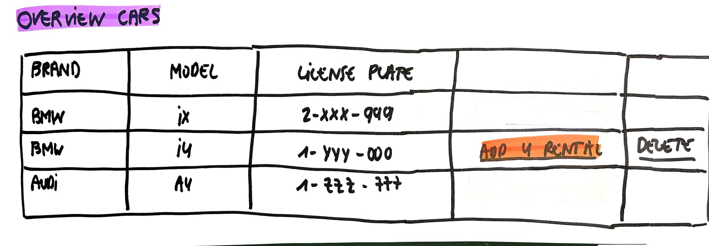
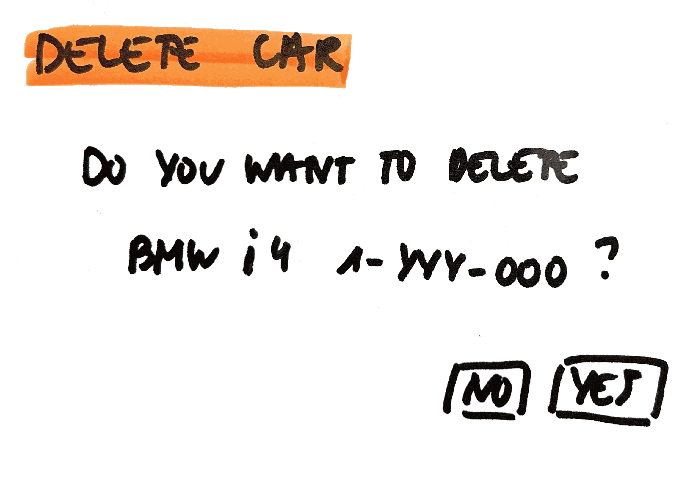

# Delete Car

As a user\
I want to delete a car that was added for rental\
So that I can't use it anymore for rental

## Mock-up

## Acceptance Criteria
* **Given** overview with all cars\
**And** the user selects a car that can be deleted (only cars that aren't been added for rental yet can be deleted)\
**And** the user gets the question whether he wants to delete this car?\
**When** the user selects yes\
**Then** this car is deleted\
**And** is no longer in the overview of all cars

* **Given** overview with all cars\
**And** the user selects a car that can be deleted (only cars that aren't been added for rental yet can be deleted)\
**And** the user gets the question whether he wants to delete this car?\
**When** the user selects no\
**Then** this car is not deleted\
**And** is still in the overview of all cars