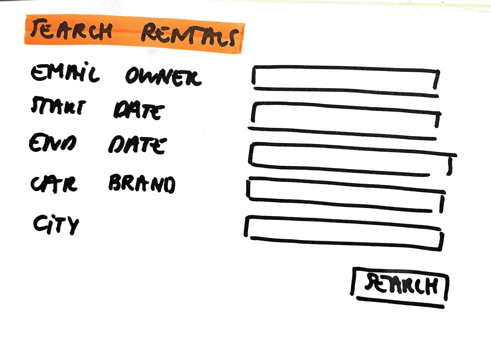

# Search Rentals

As a user\
I want to search for certain rentals\
So that I can see for instance all my own rentals, or all rentals where the car is stationed in a specific city, or rentals available for a specific start untill end date, ...

## Mock-up

## Acceptance Criteria
* **Given** the user chooses an email\
**And** there exist an owner of rentals with this email address\
**When** the user searches\
**Then** the rentals of the owner with this email address are given as a result

* **Given** the user chooses an email\
**And** there doesn't exist an owner of rentals with this email address\
**When** the user searches\
**Then** an error message "There are no rentals with this email address found as owner" is given

* **Given** the user chooses a car brand\
**And** there exist a number of rentals for this car brand\
**When** the user searches\
**Then** the rentals with this car brand are given as a result

* **Given** the user chooses a car brand\
**And** there doesn't exist a number of rentals for this car brand\
**When** the user searches\
**Then** an error message "There are no rentals with this car brand found" is given

* **Given** the user chooses a city\
**And** there exist a number of rentals for this city\
**When** the user searches\
**Then** the rentals in this city are given as a result

* **Given** the user chooses a city\
**And** there doesn't exist a number of rentals for this city\
**When** the user searches\
**Then** an error message "There are no rentals in this city found" is given

* **Given** the user chooses a start date\
**And** there exist a number of rentals for this start date\
**When** the user searches\
**Then** the rentals with this start date are given as a result

* **Given** the user chooses a start date\
**And** there doesn't exist a number of rentals for this start date\
**When** the user searches\
**Then** an error message "There are no rentals with this start date found" is given

* **Given** the user chooses a end date\
**And** there exist a number of rentals for this end date\
**When** the user searches\
**Then** the rentals with this end date are given as a result

* **Given** the user chooses a end date\
**And** there doesn't exist a number of rentals for this end date\
**When** the user searches\
**Then** an error message "There are no rentals with this end date found" is given

* **Given** the user chooses a combination of values\
**And** there exist a number of rentals for these combination of values\
**When** the user searches\
**Then** the rentals with these combination of values are given as a result

* **Given** the user chooses a combination of values\
**And** there doesn't exist a number of rentals for these combination of values\
**When** the user searches\
**Then** an error message "There are no rentals that satisfy these combination of values found" is given

* **Given** the user chooses no values\
**When** the user searches\
**Then** an error message "You need to choose one or more values to get search results" is given