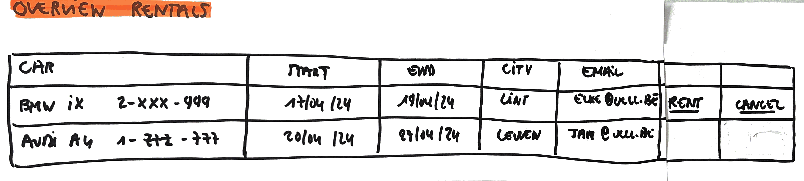
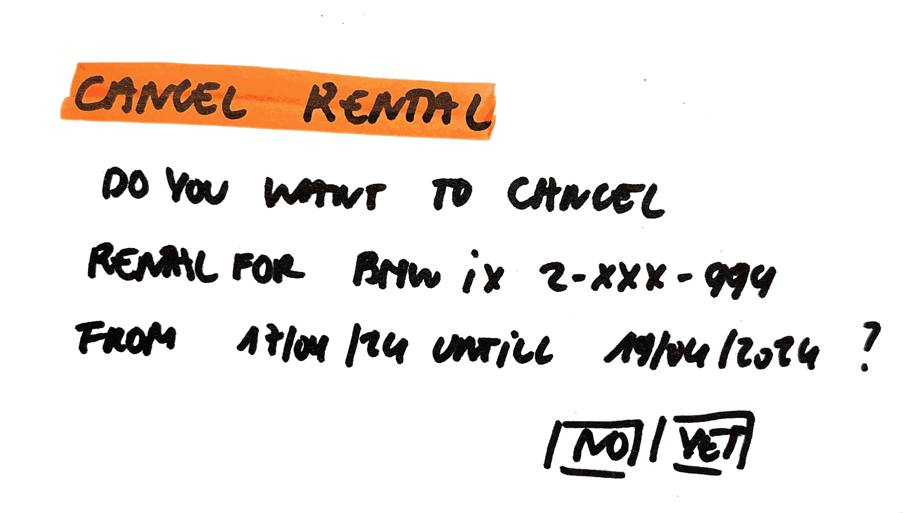

# Cancel Rental

As a user\
I want to to cancel a rental\
So that I can use the car for myself again on that moment.

## Mock-up

## Acceptance Criteria
* **Given** overview with all rentals\
**And** the user selects a rental that can be canceled (only rentals that still can be rented can be canceled)\
**And** the user gets the question whether he wants to cancel this rental?\
**When** the user selects yes\
**Then** this rental is canceled\
**And** is no longer in the overview of all rentals
**And** a cancellation notification of this cancelling is sent

* **Given** overview with all rentals\
**And** the user selects a rental that can be canceled (only rentals that still can be rented can be canceled)\
**And** the user gets the question whether he wants to cancel this rental?\
**When** the user selects no\
**Then** this rental isn't canceled\
**And** is still in the overview of all rentals
