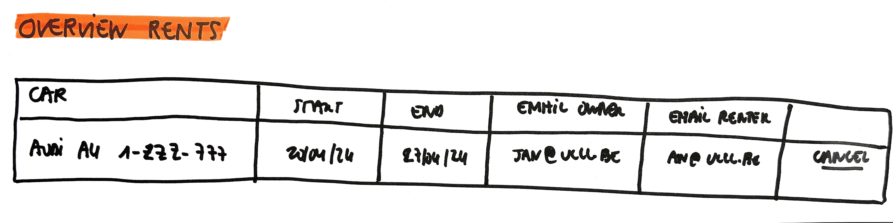

# Overview Rents

As a \
I want to \
So that I can 

## Mock-up

## Acceptance Criteria
* **Given** a number of rents available\
**When** the user wants to see the overview of all rents\
**Then** for each rental the car data (brand, model and license plate), the start date, the end date, the email of the owner and the email of the renter are given

* **Given** no rents available\
**When** the user wants to see the overview of all rents\
**Then** a message "No rents yet" is given