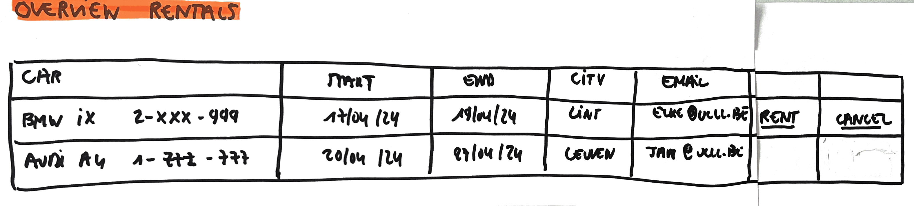

# Make Rent

As a user\
I want to rent a car \
So that I can use the car for a specific period of time that I need it

## Mock-up

## Acceptance Criteria
* **Given** a valid phone number, email address, identity number of national register, birthdate and driving licence number\
**When** the user makes the rent\
**Then** this rent is added with all the given values\
**And** the overview of all rents is given with this rent added\
**And** a notification of this rent for the specific rental is sent

* **Given** phone number value left empty\
**When** the user makes the rent\
**Then** an error message "Phone number is required" is given

* **Given** email value left empty\
**When** the user makes the rent\
**Then** an error message "Email is required" is given

* **Given** no valid email address\
**When** the user makes the rent\
**Then** an error message "Email value is invalid, it has to be of the following format xxx@yyy.zzz" is given

* **Given** identification number of national register value left empty\
**When** the user makes the rent\
**Then** an error message "Identification number of national register is required" is given

* **Given** no valid identification number of national register\
**When** the user makes the rent\
**Then** an error message "Identification number of national register is invalid, it has to be of the following format yy.mm.dd-xxx.zz" is given

* **Given** birthdate value left empty\
**When** the user makes the rent\
**Then** an error message "Birthdate is required" is given

* **Given** no valid birthdate\
**When** the user makes the rent\
**Then** an error message "Birthdate is invalid, it has to be of the following format dd-mm-yyyy" is given

* **Given** driving licence number value left empty\
**When** the user makes the rent\
**Then** an error message "Driving licence number is required" is given

* **Given** no valid driving licence number\
**When** the user makes the rent\
**Then** an error message "Driving licence number is invalid, it has to be of the following format 0000000000 (where each 0 is a number between 0 and 9)" is given
