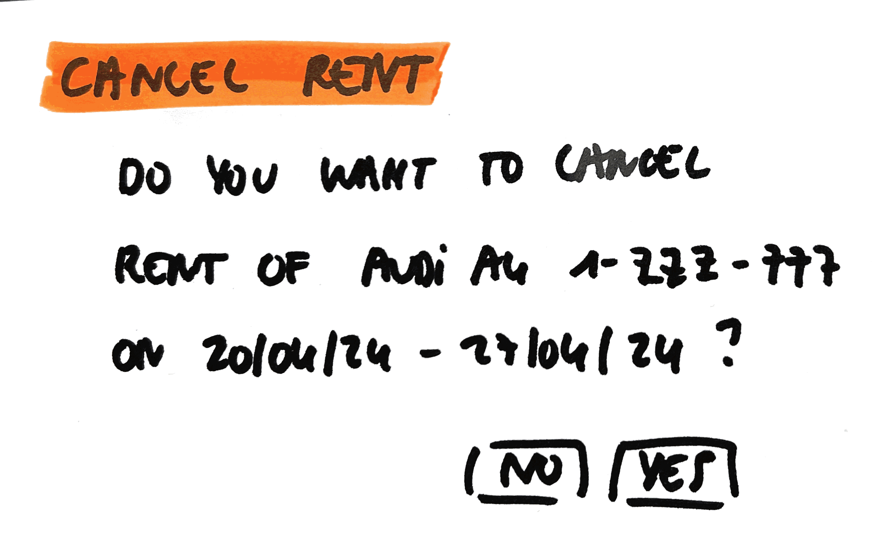

# Cancel Rent

As a user\
I want to cancel a rent\
So that I don't need to rent the car anymore because I don't need it anymore

## Mock-up

## Acceptance Criteria
* **Given** overview with all rents\
**And** the user selects the rent he wants to cancel\
**And** the user gets the question whether he wants to cancel this rent?\
**When** the user selects yes\
**Then** this rent is canceled\
**And** is no longer in the overview of all rents
**And** a cancellation notification of cancelling is sent

* **Given** overview with all rents\
**And** the user selects the rent he wants to cancel\
**And** the user gets the question whether he wants to cancel this rent?\
**When** the user selects no\
**Then** this rent isn't canceled\
**And** is still in the overview of all rents
