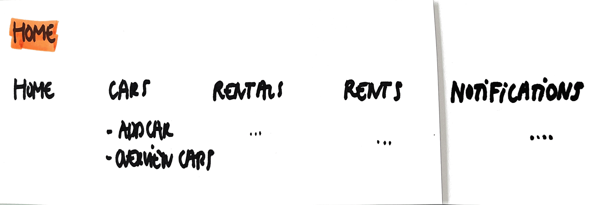

# Home

As a user\
I want to use all functionality of the Car4Rent app\
So that I can add cars, add rentals for cars, make rents, ...

## Mock-up

## Acceptance Criteria
* **Given**\
**When** the user starts using the Car4Rent application\
**Then** all functionality for managing cars are given\
**And** all functionality for managing rentals are given\
**And** all functionality for managing rents are given\
**And** all functionality for managing notifications is given