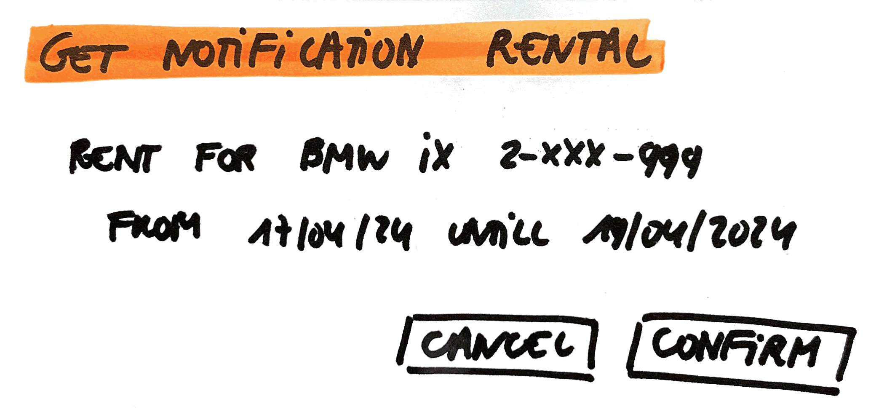

# Get Notification Rental

As a user\
I want to get notified of a new rent made for one of the rentals\
So that I can see who has rented it and so that I can confirm or cancel it

## Mock-up

## Acceptance Criteria
* **Given** a notification for a new rent for an existing rental (with as information the car brand, car type, number plate, start and end date of the new rent)\
**When** the user confirms it\
**Then** this rental can't be rented again
**And** a notification of confirmation for this rent is sent

* **Given** a notification for a new rent for an existing rental (with as information the car brand, car type, number plate, start and end date of the new rent)\
**When** the user cancels it\
**Then** this rental can be rented again
**And** a notification of cancellation for this rent is sent
