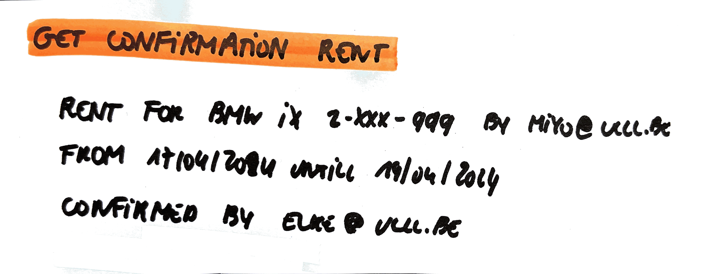

# Get Confirmation Rent

As a user\
I want to know if the rent I did is confirmed\
So that I know that I have a car the day(s) I need it

## Mock-up

## Acceptance Criteria
* **Given** a confirmation of a rent\
**When** the confirmation notification is given \
**Then** the user gets a message with the information of the rent that is confirmed (car brand, car type, number plate, email of renter and start and end date and the owner that confirmed the rent)