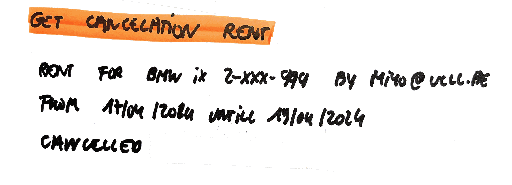

# Get Cancellation Rent

As a user\
I want to know if the rent I did is canceled\
So that I know that I have to search for another car for the day(s) I need it

## Mock-up

## Acceptance Criteria
* **Given** a cancel of a rent\
**When** the cancellation notification is given \
**Then** the user gets a message with the information of the rent that is cancelled (car brand, car type, number plate, email of renter and start and end date)