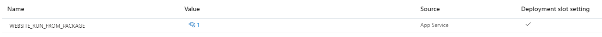

# Build a cd pipeline

## 1. Acceptance Criteria

At the end of this task you should have a workflow in your GitHub repository with one job that performs the following steps:

1. Download the package from GitHub Packages
1. Run npm install
1. Deploy the package to Azure

The workflow file should contain no sensitive information.

## 2. Implementation Details

Make sure to look at the generated workflow for inspiration for some of these sections.

### 2.1. Configure the Azure resource

Before starting we need to add an important variable to our app in Azure:
1. Go to Configuration > Application Settings
1. Add a variable with the following settings:
    * Name -> `WEBSITE_RUN_FROM_PACKAGE`
    * Value -> `1`
    * Deployment Slot Setting -> `true`

    

This makes sure that the deployed website is not extracted to the filesystem but ran from the zip archive that our pipeline will push. This avoids complexity with deploys not overwriting files from previous deploys. You can find some context [here](https://github.com/microsoft/azure-pipelines-tasks/issues/13585) if you are interested.

### 2.2. Code the workflow trigger

It is up to you how you trigger this workflow. Automatically on an appropriate trigger action or manually.

The documentation about workflow triggers can be found here:
* https://docs.github.com/en/actions/using-workflows/events-that-trigger-workflows#registry_package

If you do it manually than this link might contain useful information:
* https://damienaicheh.github.io/github/actions/2022/01/20/set-dynamic-parameters-github-workflows-en.html

### 2.3. Download the package from GitHub Packages

This is another step that will require some creativity.

Some pointers:
* Take a look at `npm pack`
* After downloading the archive you will need to extract it so that the next steps can work with the _naked_ build output directory

### 2.4. Run npm install

Run `npm install` in the directory where you extracted the archive. This will make sure that the package deployed to Azure contains everything needed for the application to run.

### 2.5. Deploy the package to Azure

1. You are almost there, check the workflow Azure generated for this step
1. After deploying Azure automatically runs `npm run start`
    * `npm run start` should point to the correct script after [3-build-a-ci-pipeline](./3-build-a-ci-pipeline.md)

### 2.6. Debugging Azure

Here are some places to look if your application is not starting up as expected and you have no clue what is wrong:
1. You can view logs from deployments in `Deployment Center`
1. You can view logs from your application after deploy in `Overview` > `Logs`
1. You can start an SSH session to your app in `SSH`
    * This will only work if your deployment and startup did not crash!

### 2.7. Finishing up

1. Hurray, your automated pipeline works!
1. You may remove the generated workflow-file from sprint-0, everything useful is copied to the new pipelines.